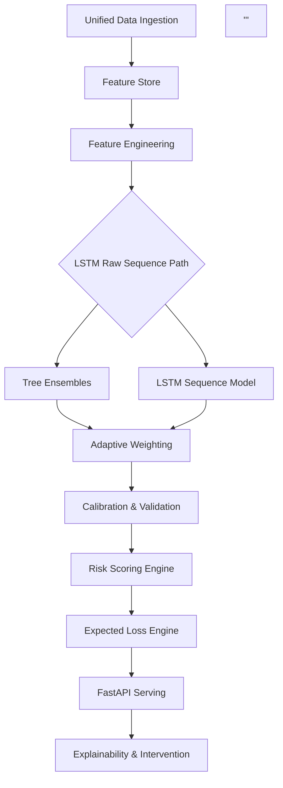

# Pre-delinquency-engine

> **Early warning system to detect customer financial stress weeks before default.**

---

## 📌 Problem Statement

Traditional banking interventions are often "too little, too late," occurring only **after a payment is missed**. This leads to:
* **High Recovery Costs:** Typically 15–20% of the recovered amount.
* **Damaged Relationships:** Collection calls stress the customer-bank bond.
* **Missed Signals:** Subtle behavioral changes often go unnoticed by legacy systems.

**Our Goal:** Detect indicators like salary delays, rising credit utilization, and balance deterioration to **predict default risk 2–4 weeks in advance.**

---

## 🎯 Solution
A **Hybrid AI Risk Engine** designed for proactive financial health monitoring:

* 🔍 **Early Stress Detection:** Identifies behavioral drift before the first missed payment.
* 📈 **Probability of Default (PD):** Predicts next-month risk with high precision.
* 💰 **Financial Impact:** Computes **Expected Loss (PD × LGD × EAD)** for provisioning.
* 🧊 **Cold-Start Support:** Robust handling for customers with short credit histories.
* ⚡ **Real-time Scoring:** FastAPI-powered inference for instant risk assessment.

---

## 🧠 Model Architecture

### Hybrid Intelligence
We utilize a two-pronged approach to capture both static snapshots and temporal trends:

1.  **Tree Ensemble (XGBoost, LightGBM, CatBoost):** Captures complex, nonlinear relationships in tabular transaction data.
2.  **LSTM Sequence Model (PyTorch):** Analyzes chronological behavior to detect "downward spirals" over time.
3.  **Weighted Hybrid Blend:** An ensemble layer that calibrates outputs from both models for bank-grade reliability.

---

## 🏗️ System Architecture

---

## 📊 Model Performance
| Metric | Value | Status |
|---|---|---|
| Tree Holdout AUC | 0.825 | ✅ High Discrimination |
| Hybrid AUC | 0.82 – 0.83 | ✅ Robust |
| Calibration | Logistic | ✅ Probability Stable |
| Cold Start | Supported | ✅ Production Ready |

## ⚙️ Tech Stack
 * Machine Learning: PyTorch (LSTM), XGBoost, LightGBM, CatBoost, Scikit-learn, Optuna (Tuning).
 * Backend: FastAPI, Python, Pandas, NumPy, Joblib.
 * Deployment: Docker-ready, Real-time API, Model Registry compatible.

## 📁 Project Structure
content_backup/
├── models/
│   ├── xgb_model.pkl
│   ├── lgb_model.pkl
│   ├── cat_model.cbm
│   ├── lstm_model_state.pt
│   ├── lstm_scaler.pkl
│   ├── calibrator.pkl
│   ├── tree_feature_columns.pkl
│   ├── lstm_feature_columns.pkl
│   └── hybrid_config.json
│
├── model_loader.py
├── predictor.py
├── feature_engineering.py
├── risk_engine.py
├── inference.py
├── app.py
└── notebook.ipynb

## 🚀 Getting Started
1. Install Dependencies
pip install -r requirements.txt

2. Run Local Inference
python inference.py

3. Launch FastAPI Server
uvicorn app:app --reload

Access the interactive API docs at: http://127.0.0.1:8000/docs

## 🧪 Example API Response
{
  "probability_of_default": 0.3124,
  "risk_bucket": "MEDIUM",
  "expected_loss": 15234.21,
  "lgd": 0.45,
  "ead": 98000,
  "signals": ["Salary_Delay_Detected", "Credit_Utilization_Spike"]
}

## 👨‍💻 Authors
Shreesh Jugade
Shreeyash Indulkar
Daksh Padmavat
Ayush Shevde
Aarya Pawar

⭐ If you find this project useful for your risk modeling research, please consider giving it a star!

---
