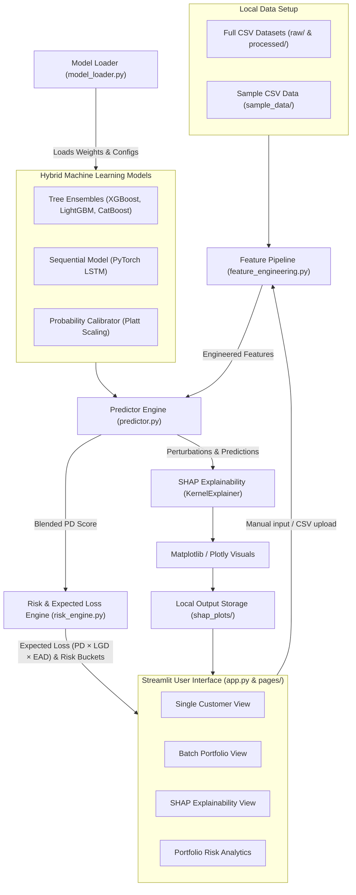

# EarlyShield - Pre-delinquency-Risk-Engine

> **Early warning system to detect customer financial stress weeks before default.**

---

## Problem Statement

Economic uncertainty is increasing financial stress, leading to higher delinquency risk for banks. Most institutions react **after payment failure**, when recovery is costly and less effective.

However, early warning signals exist but remain hidden in fragmented systems.

**EarlyShield** is an end-to-end pre-delinquency risk analytics framework that detects emerging customer distress early and enables proactive intervention.

Traditional banking interventions are often "too little, too late," occurring only **after a payment is missed**. 

### Key Challenges:
* **High Recovery Costs:** Typically 15–20% of the recovered amount.
* **Damaged Relationships:** Collection calls stress the customer-bank bond.
* **Missed Signals:** Subtle behavioral changes often go unnoticed by legacy systems.

**Our Goal:** Detect indicators like salary delays, rising credit utilization, and balance deterioration to **predict default risk 2–4 weeks in advance.**

---
## Proposed Solution
-  Customer-level credit monitoring  
-  Calibrated Probability of Default (PD)  
-  Loss Given Default (LGD) estimation  
-  Exposure at Default (EAD) quantification  
-  Real-time and batch risk scoring  
-  Behavioral trend modeling  
-  Proactive intervention support

### Machine Learning Value 
*  **Early Stress Detection:** Evaluates transaction alerts, cash flow trajectories, and credit limits.
*  **Next Month PD Prediction:** Looks ahead 2–4 weeks using sequential and tabular patterns.
*  **Expected Loss:** Computes EL = PD × LGD × EAD dynamically.
*  **Cold-Start Customer Handling:** Graceful fallback for new customers with limited history.
*  **SHAP Explainability:** Interprets risk drivers per customer to meet compliance and audit requirements.
*  **Streamlit Dashboard:** Provides an interactive multi-page portal for risk officers.

---

## Model Architecture

### Hybrid Intelligence
We use a two-pronged approach:

1.  **Tree Ensemble (XGBoost, LightGBM, CatBoost):** Captures complex, nonlinear relationships in tabular transaction data.
2.  **LSTM Sequence Model (PyTorch):** Analyzes chronological behavior to detect "downward spirals" over time.
3.  **Weighted Hybrid Blend:** An ensemble layer that calibrates outputs from both models for bank-grade reliability.

---

## Architecture Diagram


```mermaid
flowchart TD
    %% ===== FRONTEND USER INTERFACE =====
    subgraph UI["Streamlit User Interface (app.py & pages/)"]
        A1["Single Customer View"]
        A2["Batch Portfolio View"]
        A3["SHAP Explainability View"]
        A4["Portfolio Risk Analytics"]
    end

    %% ===== CORE LOGIC PIPELINE =====
    B1["Feature Pipeline (feature_engineering.py)"]
    B2["Predictor Engine (predictor.py)"]
    B3["Risk & Expected Loss Engine (risk_engine.py)"]
    B4["Model Loader (model_loader.py)"]

    %% ===== MODELS =====
    subgraph ML["Hybrid Machine Learning Models"]
        M1["Tree Ensembles (XGBoost, LightGBM, CatBoost)"]
        M2["Sequential Model (PyTorch LSTM)"]
        M3["Probability Calibrator (Platt Scaling)"]
    end

    %% ===== EXPLAINABILITY & OUTPUTS =====
    C1["SHAP Explainability (KernelExplainer)"]
    C2["Matplotlib / Plotly Visuals"]
    C3["Local Output Storage (shap_plots/)"]

    %% ===== DATA SOURCE =====
    subgraph DATA["Local Data Setup"]
        D1["Full CSV Datasets (raw/ & processed/)"]
        D2["Sample CSV Data (sample_data/)"]
    end

    %% ===== DATA & CONTROL FLOW =====
    UI -- "Manual input / CSV upload" --> B1
    DATA --> B1
    B1 -- "Engineered Features" --> B2
    B4 -- "Loads Weights & Configs" --> ML
    ML --> B2
    B2 -- "Blended PD Score" --> B3
    B2 -- "Perturbations & Predictions" --> C1
    B3 -- "Expected Loss (PD × LGD × EAD) & Risk Buckets" --> UI
    C1 --> C2
    C2 --> C3
    C3 --> UI
```
---

## Key Features
### Secure & Enterprise-Ready
- Role-based views
- Local audit logging
- Rate limiting simulation

### Interactive Dashboards
- Multi-page navigation (Sidebar navigation)
- Real-time customer profile scoring
- Interactive Plotly analytics

### Explainable AI
- Dynamic SHAP waterfall explanations
- Visualizing feature contributions (risk pushers and pullers)
- Compliant decision transparency

### Continuous Monitoring
- Expected Loss tracking
- Stress flag detection
- Downward spiral trend analysis

---

## Technical Approach
### Tree-Based Models
- XGBoost, LightGBM, and CatBoost.
- Captures complex non-linear feature interactions from tabular transaction statistics.

### Temporal Deep Learning
- PyTorch LSTM network.
- Handles rolling sequence modeling over a sliding window to track the rate of financial decay.

### Blended Ensemble
- Combines static tabular profiles and temporal risk curves.
- Platt-scaling calibration layer for accurate probability distribution.
- Cold-start handling for short-history customers.

---

## Model Performance
| Metric | Value | Status |
|---|---|---|
| Tree Holdout AUC | 0.825 | High Discrimination |
| Hybrid AUC | 0.82 – 0.83 | Stable Ensemble |
| Calibration | Logistic | Well-Calibrated PD |
| Cold Start | Supported | Production Ready |

---

## Tech Stack

| Layer         | Technology                          |
| ------------- | ----------------------------------- |
| ML Models     | XGBoost, LightGBM, CatBoost, Optuna |
| Deep Learning | LSTM (PyTorch)                      |
| Visualization | Plotly, Matplotlib, SHAP            |
| UI Framework  | Streamlit (Python)                  |

---

## Project Structure
```bash
EarlyShield/
├── app.py                     # Streamlit Main Dashboard Entrypoint
├── requirements.txt           # Project Dependencies
├── .gitignore                 # Git ignore rules
├── README.md                  # Project Documentation
├── inference.py               # Local inference verification script
├── feature_engineering.py     # Feature engineering pipeline
├── model_loader.py            # Model loading utilities
├── predictor.py               # PD prediction and ensemble blend logic
├── risk_engine.py             # LGD, EAD, and Expected Loss calculations
├── content/
│   └── models/
│       ├── hybrid_config.json # Calibrator and blending weights config
│       ├── model_metrics.json # Performance metrics
│       └── xgb_model.json     # XGBoost schema definition
├── notebook/
│   └── model_training.ipynb   # Jupyter training notebook
├── pages/                     # Dashboard pages
│   ├── 2_Single_Customer.py
│   ├── 3_Batch_Prediction.py
│   ├── 4_SHAP_Explainability.py
│   └── 5_Portfolio_Risk.py
├── sample_data/               # Small test datasets
│   ├── feature_engineered_sample.csv
│   └── financial_stress_sample.csv
├── shap_plots/                # Saved SHAP waterfall and summary plots
└── utils/                     # UI styling and charting helpers
    ├── charts.py
    ├── data_utils.py
    └── styles.py
```
---

## Data Setup
Due to file size limits, the full datasets are not included in this repository. 

**Required Files:**
1. **Raw Dataset:** `raw/financial_stress_full_bank_grade_dataset.csv`
2. **Engineered Dataset:** `processed/feature_engineered_dataset.csv`

> [!TIP]
> **Sample Data Available**: You can find small sample datasets in the `sample_data/` directory to test the code immediately without downloading the full files.

**Download Instructions:**
- The datasets are hosted on Google Drive:
1. `financial_stress_full_bank_grade_dataset.csv`: [Download Link](https://drive.google.com/uc?export=download&id=1ZSSO1zixr6jjDfGS_f4ipiMsF-0Yh6vH)
2. `feature_engineered_dataset.csv`: [Download Link](https://drive.google.com/uc?export=download&id=1XHJpCc6ACdNbzAwk9kgdCp5IERDV65eM)
.
- Place the raw CSV in `raw/`.
- Place the engineered CSV in `processed/`.

---

## Model Setup
The pre-trained models are **not included** in the repository to keep it lightweight.

**Required Model Files:**
Place the following files in `content/models/`:

### Tree / Ensemble Models

- **xgb_model.pkl**  
  https://drive.google.com/uc?export=download&id=1LQklMy18I6xrznPicOC_Y_uNGArwsD_H

- **lgb_model.pkl**  
  https://drive.google.com/uc?export=download&id=1M5dzmvS4CiU-QIszzYYSwoDcu4a40sUa

- **cat_model.cbm**  
  https://drive.google.com/uc?export=download&id=1XB1xs9FwPsq2UfzFK19gF8_6MOnJlkxA

- **gb_model.pkl**  
  https://drive.google.com/uc?export=download&id=1xwlYD5U3udl5BSNaEQwfXryEXkA6eA_r

### LSTM Models

- **lstm_model_state.pt**  
  https://drive.google.com/uc?export=download&id=1JiXJXcOsYxHVeLuYf6iw1xcJdIdJI5zY

- **lstm_scaler.pkl**  
  https://drive.google.com/uc?export=download&id=17vOcastq350It2MjowrOYGgwhCZcfTzB

- **lstm_feature_columns.pkl**  
  https://drive.google.com/uc?export=download&id=1CvpkGyqAP_qiPyg-ioLfWpINiWjcuZbC

### Feature Metadata

- **tree_feature_columns.pkl**  
  https://drive.google.com/uc?export=download&id=18fjqjS8lgM0-jDbTCqsHdVYmYnOR7aRI

### Calibration Layer

- **calibrator.pkl**  
  https://drive.google.com/uc?export=download&id=1oqsPjnPT1_PzVKzkmaakvmfww_-gEQ7Z

---

## Getting Started

### 1. Install Dependencies
```bash
pip install -r requirements.txt
```

### 2. Run Local Inference Verification
Verify that your environment is working and models load cleanly by running:
```bash
python inference.py
```

### 3. Launch the Streamlit Web Application
Run the dashboard server locally:
```bash
streamlit run app.py
```

Streamlit will print the local URL (typically `http://localhost:8501`) where you can interact with the system.

---

## Example API Response (Inference Format)
When running `inference.py`, you will see outputs in the following structured format:
```json
{
  "probability_of_default": 0.0850,
  "risk_bucket": "LOW",
  "expected_loss": 4674.38,
  "lgd": 0.45,
  "ead": 10387.51
}
```

---

## Authors
- Shreesh Jugade
- Shreeyash Indulkar
- Ayush Shevde
- Daksh Padmavat
- Aarya Pawar

---

If you find this project useful for your risk modeling research, please consider giving it a star!
