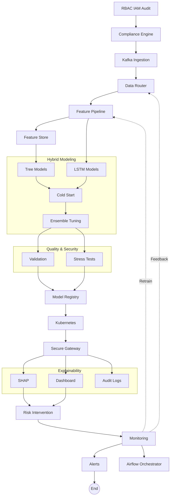

# EarlyShield - Pre-delinquency-Risk-Engine

> **Early warning system to detect customer financial stress weeks before default.**

---

## Problem Statement

Economic uncertainty is increasing financial stress, leading to higher delinquency risk for banks. Most institutions react **after payment failure**, when recovery is costly and less effective.

However, early warning signals exist but remain hidden in fragmented systems.

**EarlyShield** is an end-to-end pre-delinquency risk analytics framework that detects emerging customer distress early and enables proactive intervention.

Traditional banking interventions are often "too little, too late," occurring only **after a payment is missed**. 

### Key Challenges:
* **High Recovery Costs:** Typically 15–20% of the recovered amount.
* **Damaged Relationships:** Collection calls stress the customer-bank bond.
* **Missed Signals:** Subtle behavioral changes often go unnoticed by legacy systems.

**Our Goal:** Detect indicators like salary delays, rising credit utilization, and balance deterioration to **predict default risk 2–4 weeks in advance.**

---
## Proposed Solution
-  Customer-level credit monitoring  
-  Calibrated Probability of Default (PD)  
-  Loss Given Default (LGD) estimation  
-  Exposure at Default (EAD) quantification  
-  Real-time and batch risk scoring  
-  Behavioral trend modeling  
-  Proactive intervention support

### Machine Learning Value 
*  **Early Stress Detection:**
*  **Next Month PD Prediction:**
*  **Expected Loss = PD × LGD × EAD**
*  **Cold-Start Customer Handling:**
*  **SHAP Explainability**
*  **FastAPI Real-time Scoring:**

---

## Model Architecture


### Hybrid Intelligence
We use a two-pronged approach:

1.  **Tree Ensemble (XGBoost, LightGBM, CatBoost):** Captures complex, nonlinear relationships in tabular transaction data.
2.  **LSTM Sequence Model (PyTorch):** Analyzes chronological behavior to detect "downward spirals" over time.
3.  **Weighted Hybrid Blend:** An ensemble layer that calibrates outputs from both models for bank-grade reliability.

---

## Architecture Diagram


---

## Key Features
### Secure & Enterprise-Ready
- RBAC + IAM
- Audit logging
- OAuth2 & JWT
- Rate limiting

### Scalable Pipeline
- Kafka streaming
- Partitioning and replication
- Fault-tolerant ingestion
- Million record scale

### Production MLOps
- Model registry
- Approval workflow
- Versioning & rollback
- Docker + Kubernetes
- Auto-scaling

### Explainable AI
- SHAP explanations
- Logged predictions
- Risk dashboards
- Compliance-ready

### Continuous Monitoring
- Performance monitoring
- Drift detection
- Security alerts
- Auto retraining 

---

## Technical Approach
### Tree-Based Models
- XGBoost
- LightGBM
- CatBoost
- Capture complex non-linear feature interactions

### Temporal Deep Learning
- LSTM network 
- Rolling sequence modeling
- Short-term behavioral trajectory learning

### Weighted Ensemble
- Combines structural and temporal PD
- Optuna-based hyperparameter tuning
- Probability calibration for reliable scores
- Cold Start Handler

### Data & Modeling Strengths
- Leakage-safe customer-level validation
- Longitudinal behavioral tracking
- Cross-product stress propagation
- Multi-dimensional financial stress signals
- Portfolio-level early-warning visibility

---

## Model Performance
| Metric | Value | Status |
|---|---|---|
| Tree Holdout AUC | 0.825 | Strong Discrimination |
| Hybrid AUC | 0.82 – 0.83 | Stable Ensemble |
| Calibration | Logistic | Calibrated PD |
| Cold Start | Supported | Production Ready |

---

## Tech Stack

| Layer         | Technology                          |
| ------------- | ----------------------------------- |
| ML Models     | XGBoost, LightGBM, CatBoost, Optuna |
| Deep Learning | LSTM                                |
| Feature Store | Feast                               |
| Streaming     | Apache Kafka                        |
| Orchestration | Apache Airflow                      |
| Visualization | TypeScript, JavaScript              |
| Deployment    | Docker, Kubernetes                  |


---

## Project Structure
```bash
EarlyShield/
├── content/ 
│   ├── models/ 
│   │   ├── xgb_model.pkl
│   │   ├── lgb_model.pkl
│   │   ├── cat_model.cbm
│   │   ├── lstm_model_state.pt
│   │   ├── lstm_scaler.pkl
│   │   ├── calibrator.pkl
│   │   ├── tree_feature_columns.pkl
│   │   ├── lstm_feature_columns.pkl
│   │   └── hybrid_config.json
│
├── model_loader.py
├── predictor.py
├── feature_engineering.py
├── risk_engine.py
├── inference.py
├── app.py
├── requirements.txt
├── .gitignore
├── README.md
├── sample_data/
│   ├── financial_stress_sample.csv
│   └── feature_engineered_sample.csv
└── notebook/
    └── model_training.ipynb
```
---

## Data Setup
Due to file size limits, the full datasets are not included in this repository. 

**Required Files:**
1. **Raw Dataset:** `data/raw/financial_stress_full_bank_grade_dataset.csv`
2. **Engineered Dataset:** `data/processed/feature_engineered_dataset.csv`

> [!TIP]
> **Sample Data Available**: You can find small sample datasets in the `sample_data/` directory to test the code immediately without downloading the full files.

**Download Instructions:**
- The datasets are hosted on google drive:
- 1) financial_stress_full_bank_grade_dataset.csv: https://drive.google.com/uc?export=download&id=1ZSSO1zixr6jjDfGS_f4ipiMsF-0Yh6vH
- 2) feature_engineered_dataset.csv: https://drive.google.com/uc?export=download&id=1XHJpCc6ACdNbzAwk9kgdCp5IERDV65eM
.
- Place the raw CSV in `data/raw/`.
- Place the engineered CSV in `data/processed/`.

---

## Model Setup
The pre-trained models are **not included** in the repository to keep it lightweight.

**Required Model Files:**
Place the following files in `content/models/`:

## Model Download Links

All models are hosted on Google Drive and loaded dynamically in the app.


### Tree / Ensemble Models

- **xgb_model.pkl**  
  https://drive.google.com/uc?export=download&id=1LQklMy18I6xrznPicOC_Y_uNGArwsD_H

- **lgb_model.pkl**  
  https://drive.google.com/uc?export=download&id=1M5dzmvS4CiU-QIszzYYSwoDcu4a40sUa

- **cat_model.cbm**  
  https://drive.google.com/uc?export=download&id=1XB1xs9FwPsq2UfzFK19gF8_6MOnJlkxA

- **gb_model.pkl**  
  https://drive.google.com/uc?export=download&id=1xwlYD5U3udl5BSNaEQwfXryEXkA6eA_r


### LSTM Models

- **lstm_model_state.pt**  
  https://drive.google.com/uc?export=download&id=1JiXJXcOsYxHVeLuYf6iw1xcJdIdJI5zY

- **lstm_scaler.pkl**  
  https://drive.google.com/uc?export=download&id=17vOcastq350It2MjowrOYGgwhCZcfTzB

- **lstm_feature_columns.pkl**  
  https://drive.google.com/uc?export=download&id=1CvpkGyqAP_qiPyg-ioLfWpINiWjcuZbC


### Feature Metadata

- **tree_feature_columns.pkl**  
  https://drive.google.com/uc?export=download&id=18fjqjS8lgM0-jDbTCqsHdVYmYnOR7aRI


### Calibration Layer

- **calibrator.pkl**  
  https://drive.google.com/uc?export=download&id=1oqsPjnPT1_PzVKzkmaakvmfww_-gEQ7Z


### Usage Example

```python
import requests, io, joblib

MODEL_URL = "PASTE_LINK_HERE"
response = requests.get(MODEL_URL)
model = joblib.load(io.BytesIO(response.content))

**Download Instructions:**
- Ensure `content/models/hybrid_config.json` exists (included in repo).
```
---

## Getting Started
1. Install Dependencies
pip install -r requirements.txt

2. Run Local Inference
python inference.py

3. Launch FastAPI Server
uvicorn app:app --reload

Access the interactive API docs at: http://127.0.0.1:8000/docs

## Example API Response
{
  "probability_of_default": 0.3124,
  "risk_bucket": "MEDIUM",
  "expected_loss": 15234.21,
  "lgd": 0.45,
  "ead": 98000,
  "signals": ["Salary_Delay_Detected", "Credit_Utilization_Spike"]
}

---

## Authors
- Shreesh Jugade
- Shreeyash Indulkar
- Ayush Shevde
- Daksh Padmavat
- Aarya Pawar

---

If you find this project useful for your risk modeling research, please consider giving it a star!

---
